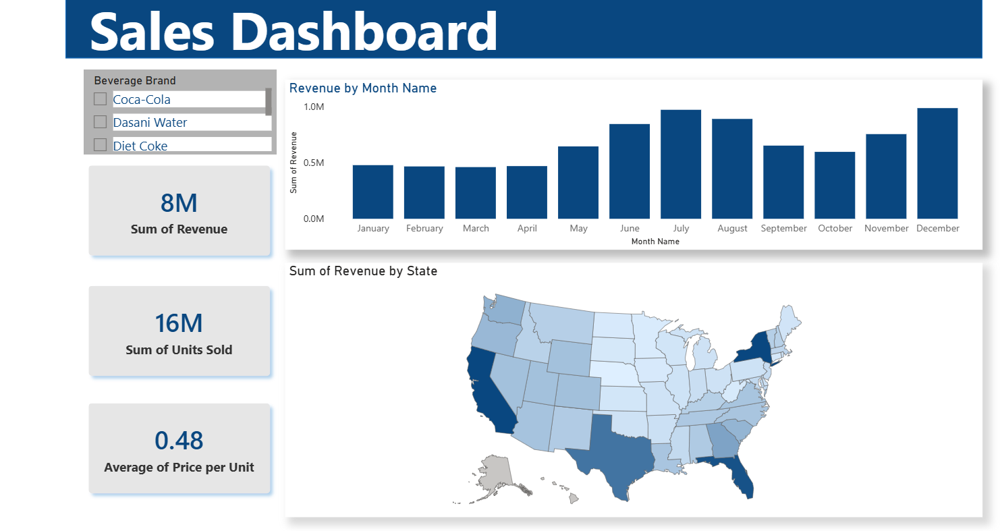

# Sales Dashboard

## Project Overview

This interactive Power BI dashboard provides an overview of sales performance across different regions, products, and time periods. It enables users to monitor key sales metrics and identify business trends through interactive visualizations.

## Dashboard Preview

## Tools Used

- Power BI
- Power Query
- DAX
- Data Modeling

## Key KPIs

- Total Revenue
- Units Sold
- Average Price per Unit

## Dashboard Features

- Sales performance by month
- Revenue analysis by state
- Product/Brand filtering using slicers
- Interactive KPI cards
- Trend analysis over time
- Geographic sales visualization

## Files

- Sales Dashboard.pbix
- Sales Dataset.xlsx
